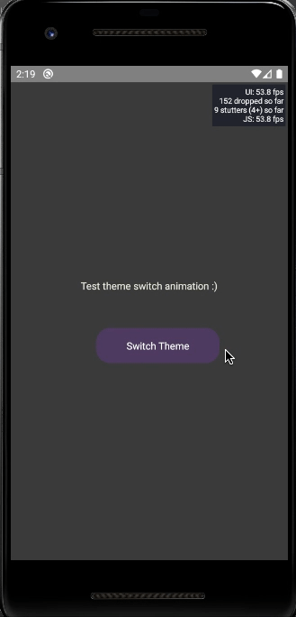

# Theme Reveal in React Native (Proof of Concept)



## Description
A simple way to create a reveal effect on switching theme (similar to Telegram) using purely React Native and pre-existing libraries working on both Android and iOS.

## Structure
This example is built on top of a Vanilla React Native project.

The `main` branch holds the final code, while the feature branches contain the steps to achieve this.
 - Theme Context and Provider
 - Reveal Animation


## Run this example
```
 $ git clone https://github.com/TimP4w/react-native-theme-reveal-poc
 $ cd react-native-theme-reveal-poc
 $ yarn install
 $ yarn android
```

## License
```
MIT License

Copyright (c) 2021 Timucin Besken

Permission is hereby granted, free of charge, to any person obtaining a copy
of this software and associated documentation files (the "Software"), to deal
in the Software without restriction, including without limitation the rights
to use, copy, modify, merge, publish, distribute, sublicense, and/or sell
copies of the Software, and to permit persons to whom the Software is
furnished to do so, subject to the following conditions:

The above copyright notice and this permission notice shall be included in all
copies or substantial portions of the Software.

THE SOFTWARE IS PROVIDED "AS IS", WITHOUT WARRANTY OF ANY KIND, EXPRESS OR
IMPLIED, INCLUDING BUT NOT LIMITED TO THE WARRANTIES OF MERCHANTABILITY,
FITNESS FOR A PARTICULAR PURPOSE AND NONINFRINGEMENT. IN NO EVENT SHALL THE
AUTHORS OR COPYRIGHT HOLDERS BE LIABLE FOR ANY CLAIM, DAMAGES OR OTHER
LIABILITY, WHETHER IN AN ACTION OF CONTRACT, TORT OR OTHERWISE, ARISING FROM,
OUT OF OR IN CONNECTION WITH THE SOFTWARE OR THE USE OR OTHER DEALINGS IN THE
SOFTWARE.
```